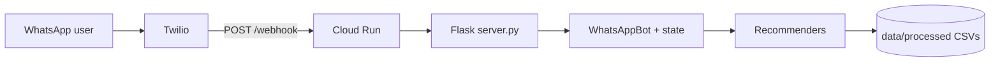

# Multi-brand jeans fit recommender (WhatsApp)

Conversational **WhatsApp** bot that recommends men’s jeans across **Naked & Famous**, **Nudie Jeans**, and **Levi’s** from fit preference, an optional reference model/size, and short measurement-style questions (rise, thigh, leg). Includes an **on-sale / promotional** path when the user skips fit and has no reference brand.

Built as a portfolio project: **Python** recommendation logic over curated **CSV** data, **Flask** webhook, **Twilio** WhatsApp, deployable to **Google Cloud Run**.

## Live demo (WhatsApp)

1. Use [Twilio’s WhatsApp Sandbox](https://www.twilio.com/docs/whatsapp/sandbox): join with the code Twilio shows for your account.
2. In Twilio Console → **Sandbox** → **Sandbox settings**, set **When a message comes in** to your deployed webhook URL (see [Deploy to Cloud Run](docs/DEPLOY_GCP.md)):
   ```text
   https://YOUR-SERVICE-REGION.run.app/webhook
   ```
   Method: **POST**. Use your **Cloud Run** URL here — not ngrok — if you want the demo to work while your laptop is off.
3. Message the sandbox number with **`start`**, then follow the prompts (`help`, `reset` also work).

**Note:** Twilio **trial** accounts have tight **daily outbound** limits; long bot replies split into multiple WhatsApp messages each count toward that limit. See [Twilio trial limitations](https://support.twilio.com/hc/en-us/articles/360036052753-Twilio-Free-Trial-Limitations).

## Architecture



- **`server.py`** — Flask app, TwiML responses, splits long replies for Twilio segment limits.
- **`src/whatsapp/`** — Conversation flow, session state (in-memory), formatting.
- **`src/recommenders/`** — Data loading, fit mapping, scoring, main + promo recommenders ([detail](src/recommenders/README.md)).
- **`src/scrapers/`** — Pipelines to refresh product/measurement CSVs (optional for running the bot).
- **`data/processed/`** — Product lists, size charts, fit metadata used at runtime.

## Requirements

- **Python 3.11+** (matches Docker image).
- Full local stack: `pip install -r requirements.txt`.
- **WhatsApp webhook only** (e.g. Cloud Run): `requirements-webhook.txt` + `Dockerfile`.

## Quick start (local bot, no WhatsApp)

```bash
cd "/path/to/N&F_SideProject"
python -m venv .venv
source .venv/bin/activate   # Windows: .venv\Scripts\activate
pip install -r requirements.txt
python test_chatbot_flow.py
```

## WhatsApp locally (Twilio + ngrok)

See **[WHATSAPP_SETUP.md](WHATSAPP_SETUP.md)**. Use port **8080** (or your `PORT` in `.env`) so ngrok matches Flask.

Copy secrets from `.env.example` → `.env` (never commit `.env`).

## Deploy (Google Cloud Run)

See **[docs/DEPLOY_GCP.md](docs/DEPLOY_GCP.md)** and **`scripts/deploy_cloud_run.sh`**.

New GCP projects may need extra IAM on the default compute service account for **Artifact Registry** and **Cloud Storage** (documented in that guide).

## Repository layout

| Path | Purpose |
|------|--------|
| `server.py` | Flask entrypoint |
| `src/whatsapp/` | Bot, state, message formatting |
| `src/recommenders/` | Recommendation engines |
| `src/scrapers/` | Data collection |
| `data/processed/` | Runtime CSVs for the recommender |
| `Dockerfile` | Production image for Cloud Run |
| `requirements-webhook.txt` | Minimal deps for the webhook image |

## Push to GitHub

1. Create a **new empty repository** on GitHub (no README/license there — this repo already has them).
2. From the project root:

```bash
cd "/path/to/N&F_SideProject"
git remote add origin https://github.com/YOUR_USER/YOUR_REPO.git
git branch -M main
git push -u origin main
```

If you **replaced local history** (e.g. after fixing secret-scanning blocks) and the remote already has commits, use:

`git push -u origin main --force`

3. On the GitHub repo page, add **Topics** (e.g. `python`, `recommendation-system`, `whatsapp`, `twilio`, `google-cloud-run`, `flask`, `retail`, `fashion`) so recruiters can discover it.

Set your Git author if needed: `git config user.email "you@example.com"` and `git config user.name "Your Name"` before amending commits: `git commit --amend --reset-author`.

## License

This project is licensed under the MIT License — see [LICENSE](LICENSE).

Product names and retailer data are used for educational / portfolio purposes and are not affiliated with or endorsed by those brands.
